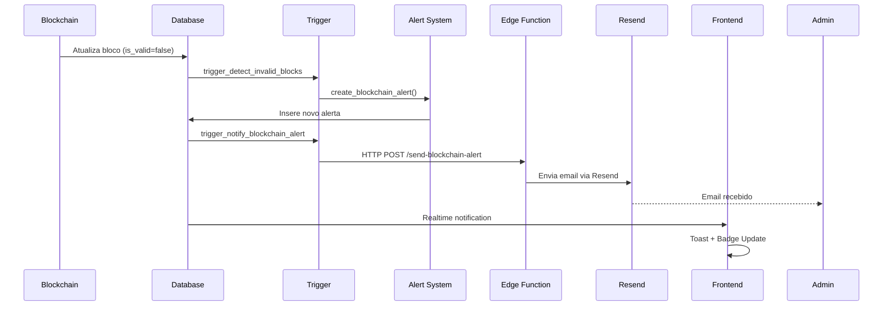

# Sistema de Alertas Blockchain em Tempo Real

## Visão Geral

Sistema completo de notificações em tempo real para alertas de segurança da blockchain, incluindo detecção automática de inconsistências, envio de emails e notificações no dashboard.

## Arquitetura

### 1. Banco de Dados

#### Tabela `blockchain_alerts`
Armazena todos os alertas de segurança relacionados à blockchain:
- **Tipos de Alerta**: `invalid_block`, `chain_compromised`, `validation_failed`
- **Severidade**: `low`, `medium`, `high`, `critical`
- **Status**: `is_read`, `is_resolved`
- **Rastreamento de Email**: `email_sent`, `email_sent_at`

#### Triggers Automáticos

1. **`trigger_detect_invalid_blocks`**
   - Detecta quando um bloco se torna inválido
   - Cria automaticamente um alerta crítico
   - Executa em tempo real após UPDATE na tabela `blockchain_records`

2. **`trigger_notify_blockchain_alert`**
   - Dispara para alertas de severidade HIGH ou CRITICAL
   - Chama edge function para envio de emails
   - Executa de forma assíncrona (não bloqueia a transação)

### 2. Edge Function: `send-blockchain-alert`

Responsável pelo envio de emails de alerta aos administradores.

#### Recursos:
- ✅ Envio via Resend API
- ✅ Template HTML responsivo e profissional
- ✅ Cores e badges baseados na severidade
- ✅ Detalhes completos do alerta
- ✅ Link direto para o painel blockchain
- ✅ Marca alertas como enviados no banco

#### Configuração Necessária:
```bash
RESEND_API_KEY=re_xxxxx
```

### 3. Notificações em Tempo Real

#### Hook `useBlockchainAlerts`
- Carrega alertas do banco de dados
- Subscribe para mudanças em tempo real via Supabase Realtime
- Exibe toast notifications para alertas críticos
- Gerencia estados: lido, não lido, resolvido

#### Componente `BlockchainAlertBell`
- Indicador visual no header da aplicação
- Badge animado mostrando contagem de alertas não lidos
- Ícone pulsante para alertas críticos
- Click para navegar ao painel blockchain

### 4. Painel de Alertas

#### Componente `BlockchainAlertsPanel`
Painel completo de gerenciamento de alertas:
- **Alertas Ativos**: Lista de alertas pendentes
- **Alertas Resolvidos**: Histórico de alertas resolvidos
- **Ações Disponíveis**:
  - Marcar como lido
  - Marcar como resolvido
  - Marcar todos como lidos
- **Indicadores Visuais**:
  - Badge de severidade com cores
  - Status de envio de email
  - Timestamp formatado

## Fluxo de Funcionamento

### Detecção de Inconsistência



### Notificação em Tempo Real

1. **Backend**: Bloco inválido detectado → Trigger cria alerta
2. **Database**: Alerta inserido → Notificação Realtime emitida
3. **Frontend**: Hook recebe notificação → Atualiza estado
4. **UI**: 
   - Badge no header atualizado
   - Toast notification exibido
   - Painel de alertas atualizado

## Componentes da Interface

### 1. Header (Desktop & Mobile)
```tsx
<BlockchainAlertBell />
// Mostra badge com contagem de alertas não lidos
// Anima quando há alertas críticos
```

### 2. Página Blockchain
```tsx
<BlockchainAlertsPanel />
// Painel completo com:
// - Lista de alertas ativos
// - Lista de alertas resolvidos
// - Ações de gerenciamento
```

### 3. Toast Notifications
```tsx
// Exibido automaticamente para alertas HIGH/CRITICAL
toast.error('🚨 Alerta de Segurança Blockchain', {
  description: alert.message,
  action: { label: 'Ver Detalhes', onClick: ... }
})
```

## Tipos de Alertas

### 1. Invalid Block (Bloco Inválido)
- **Severidade**: CRITICAL
- **Causa**: Hash do bloco não corresponde ao esperado
- **Ação Necessária**: Investigar possível adulteração

### 2. Chain Compromised (Cadeia Comprometida)
- **Severidade**: CRITICAL
- **Causa**: Múltiplos blocos inválidos detectados
- **Ação Necessária**: Auditoria completa do sistema

### 3. Validation Failed (Falha na Validação)
- **Severidade**: HIGH
- **Causa**: Erro ao validar integridade da cadeia
- **Ação Necessária**: Revalidar blockchain manualmente

## Configuração de Emails

### Template HTML
O template de email inclui:
- **Header** com gradiente e ícone de severidade
- **Badge** colorido baseado na severidade
- **Detalhes** do alerta em formato estruturado
- **Warning Box** para alertas críticos
- **CTA Button** para acessar o painel
- **Footer** com informações de contato

### Cores por Severidade
```typescript
const severityConfig = {
  low: { color: "#3b82f6", label: "Baixa", emoji: "ℹ️" },
  medium: { color: "#f59e0b", label: "Média", emoji: "⚠️" },
  high: { color: "#ef4444", label: "Alta", emoji: "🚨" },
  critical: { color: "#dc2626", label: "Crítica", emoji: "🔥" }
}
```

## Segurança

### RLS Policies
```sql
-- Visualização: Apenas membros da organização
CREATE POLICY "Users can view alerts from their organization"
  ON blockchain_alerts FOR SELECT
  USING (org_id IN (SELECT org_id FROM user_organizations WHERE user_id = auth.uid()));

-- Atualização: Apenas admins
CREATE POLICY "Admins can update alerts"
  ON blockchain_alerts FOR UPDATE
  USING (org_id IN (
    SELECT uo.org_id FROM user_organizations uo
    JOIN user_roles ur ON ur.user_id = uo.user_id
    WHERE uo.user_id = auth.uid() AND ur.role IN ('admin', 'superadmin')
  ));
```

## Monitoramento

### Métricas Disponíveis
- Total de alertas por organização
- Alertas não lidos
- Alertas não resolvidos
- Taxa de resolução
- Emails enviados vs falhas

### Logs
Todos os eventos são logados:
- Criação de alertas
- Envio de emails
- Marcação como lido/resolvido
- Erros de processamento

## Próximos Passos

1. **Dashboard de Métricas**: Gráficos de alertas ao longo do tempo
2. **Alertas via SMS**: Integração com Twilio
3. **Webhooks**: Notificar sistemas externos
4. **Relatórios Automáticos**: Resumo semanal de segurança
5. **Machine Learning**: Detecção preditiva de anomalias

## Testando o Sistema

### 1. Simular Bloco Inválido
```sql
-- Marcar um bloco como inválido para testar
UPDATE blockchain_records 
SET is_valid = false 
WHERE id = 'algum-id-de-bloco';
```

### 2. Verificar Alerta Criado
```sql
SELECT * FROM blockchain_alerts 
WHERE alert_type = 'invalid_block' 
ORDER BY created_at DESC 
LIMIT 1;
```

### 3. Verificar Logs da Edge Function
Acesse: https://supabase.com/dashboard/project/wrdyffwjlylgxfbxbztf/functions/send-blockchain-alert/logs

## Troubleshooting

### Emails não enviados
1. Verifique se `RESEND_API_KEY` está configurada
2. Verifique se o domínio está validado no Resend
3. Verifique logs da edge function
4. Verifique se há emails de admin cadastrados

### Notificações em tempo real não funcionam
1. Verifique se a tabela está publicada no Realtime
2. Verifique console do navegador para erros
3. Verifique conexão com Supabase

### Alertas não sendo criados
1. Verifique se os triggers estão ativos
2. Verifique logs do Postgres
3. Verifique RLS policies

## Suporte

Para questões técnicas ou problemas, contate o time de desenvolvimento.
