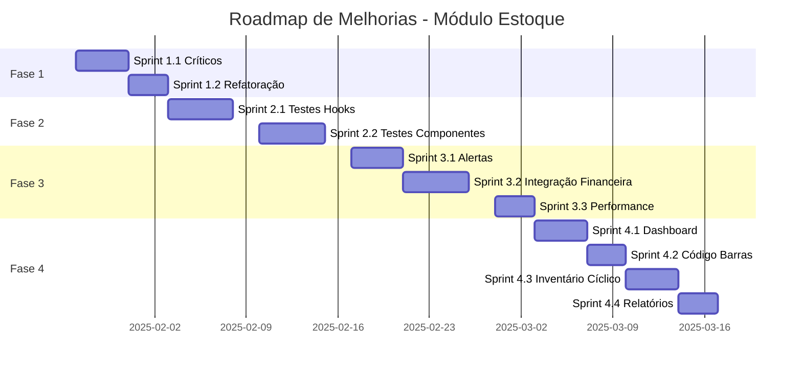

# 📦 Revisão Completa do Módulo de Estoque - 2025

**Data:** 2025-01-22  
**Versão:** 1.0  
**Status:** 🚧 Em Desenvolvimento

---

## 📋 Sumário Executivo

O módulo de estoque está **70% implementado** com funcionalidades core operacionais, mas requer melhorias significativas em integração, validações, testes e UX. Esta revisão identifica 23 pontos de melhoria críticos e médios.

### Status Geral

| Categoria | Status | Cobertura |
|-----------|--------|-----------|
| **Funcionalidade Core** | ✅ Operacional | 90% |
| **Testes Automatizados** | ⚠️ Incompleto | 15% |
| **Validações** | ⚠️ Parcial | 60% |
| **UX/Performance** | ⚠️ Necessita melhorias | 55% |
| **Integração** | ⚠️ Limitada | 50% |
| **Documentação** | ⚠️ Básica | 40% |

---

## 🔍 Análise Detalhada

### 1. Arquitetura Atual

#### Páginas Principais
```
src/pages/
├── Inventory.tsx              (877 linhas) ❌ MONOLÍTICO
├── inventory/
│   ├── StockEntry.tsx         ✅ Modular
│   ├── StockExit.tsx          ✅ Modular
│   ├── StockTransfer.tsx      ✅ Modular
│   ├── LotSerial.tsx          ✅ Modular
│   ├── Returns.tsx            ✅ Modular
│   ├── InventoryAlerts.tsx    ✅ Modular
│   └── InventoryReports.tsx   ⚠️ Precisa otimização
```

#### Componentes
```
src/components/inventory/
├── StockEntryForm.tsx         (407 linhas) ⚠️ Grande
├── StockExitForm.tsx          (465 linhas) ⚠️ Grande
├── StockTransferForm.tsx      (475 linhas) ⚠️ Grande
├── ReturnManagement.tsx       (677 linhas) ❌ MUITO GRANDE
├── LotManagementPanel.tsx     ✅ OK
├── SerialNumberTracker.tsx    ✅ OK
├── ExpirationAlertsPanel.tsx  ✅ OK
└── InventoryAlertCenter.tsx   ✅ OK
```

#### Hooks Personalizados
```
src/hooks/
├── useInventoryAlerts.tsx     (351 linhas) ✅ Completo
├── useStockValidation.tsx     (289 linhas) ✅ Robusto
├── useLotManagement.tsx       (297 linhas) ✅ Completo
├── useSerialManagement.tsx    (291 linhas) ✅ Completo
└── useInventoryIntegration.tsx ⚠️ Parcial
```

---

## 🐛 Problemas Identificados

### Críticos (Prioridade ALTA)

#### 1. **Inventory.tsx é monolítico (877 linhas)**
- **Problema:** Arquivo muito grande, múltiplas responsabilidades
- **Impacto:** Dificulta manutenção e testes
- **Solução:** Refatorar em componentes menores e especializados

#### 2. **Falta de validação de lotes em transações**
- **Problema:** Saídas de estoque não validam disponibilidade de lotes FIFO
- **Impacto:** Possível inconsistência de dados
- **Localização:** `StockExitForm.tsx`, `StockTransferForm.tsx`

#### 3. **Ausência de tabela `warehouses` na integração**
- **Problema:** Formulários usam dados mock para armazéns
- **Impacto:** Funcionalidade limitada em produção
- **Arquivos afetados:** `StockEntryForm.tsx` (linhas 92-95), `ReturnManagement.tsx` (linhas 112-115)

#### 4. **Sem rollback em transações de transferência**
- **Problema:** Se a entrada falhar após saída, estoque fica inconsistente
- **Localização:** `StockTransferForm.tsx` (linhas 223-257)
- **Solução:** Implementar transação atômica ou compensação

#### 5. **Validação de estoque acontece no frontend**
- **Problema:** Pode haver race conditions entre múltiplos usuários
- **Impacto:** Risco de estoque negativo
- **Solução:** Triggers e constraints no banco de dados

### Médios (Prioridade MÉDIA)

#### 6. **ReturnManagement.tsx é muito grande (677 linhas)**
- **Refatorar em:** CustomerReturnForm, SupplierReturnForm, ReturnsList

#### 7. **Formulários repetem lógica de carregamento**
- **Problema:** Código duplicado em Entry/Exit/Transfer
- **Solução:** Hook compartilhado `useInventoryFormData()`

#### 8. **Alertas sem persistência**
- **Problema:** Alertas são recalculados a cada carregamento
- **Impacto:** Performance e histórico perdido
- **Solução:** Tabela `inventory_alerts` no banco

#### 9. **Falta de auditoria detalhada**
- **Problema:** `stock_movements` não registra usuário aprovador
- **Solução:** Adicionar campos `approved_by`, `approved_at`

#### 10. **Sem integração com módulo financeiro**
- **Problema:** Movimentações não geram lançamentos contábeis
- **Impacto:** Custo do estoque não refletido no financeiro

#### 11. **Números de série não validados em saídas**
- **Problema:** Pode-se vender produto sem selecionar serial
- **Localização:** `StockExitForm.tsx`

#### 12. **Falta paginação em listagens grandes**
- **Problema:** `Inventory.tsx` carrega todos os produtos
- **Impacto:** Performance com +1000 produtos

#### 13. **Mock data em produção**
- **Arquivos:** `StockEntryForm.tsx`, `ReturnManagement.tsx`
- **Solução:** Migração de tabelas pendentes

### Baixos (Prioridade BAIXA)

#### 14. **Falta de busca avançada**
- Filtros por fornecedor, categoria, data de validade

#### 15. **Sem exportação de relatórios**
- PDF, Excel não implementados

#### 16. **Alertas não enviados por email**
- Apenas visualização na interface

#### 17. **Falta de dashboard visual**
- Gráficos de movimentação, curva ABC

#### 18. **Sem suporte a código de barras**
- Entrada/saída manual apenas

#### 19. **Falta de inventário cíclico**
- Apenas contagem completa disponível

#### 20. **Sem integração com compras**
- Pedidos de compra não geram entrada automática

---

## 📊 Métricas de Qualidade

### Linhas de Código
```
Total: ~8.500 linhas
├── Páginas: 2.100 linhas
├── Componentes: 3.800 linhas
├── Hooks: 2.100 linhas
└── Utils: 500 linhas
```

### Complexidade Ciclomática
```
Alta complexidade (>20):
- Inventory.tsx (main component)
- ReturnManagement.tsx
- StockExitForm.tsx (handleSubmit)

Média complexidade (10-20):
- StockEntryForm.tsx
- StockTransferForm.tsx
- useInventoryAlerts.tsx

Baixa complexidade (<10):
- LotManagementPanel.tsx
- SerialNumberTracker.tsx
- ExpirationAlertsPanel.tsx
```

### Cobertura de Testes
```
Hooks:
├── useStockValidation: 0%
├── useLotManagement: 0%
├── useSerialManagement: 0%
└── useInventoryAlerts: 0%

Componentes:
├── Forms: 0%
├── Panels: 0%
└── Alert Center: 0%

Total: 0% ❌
```

---

## 🎯 Plano de Melhorias

### Fase 1: Estabilização (Semanas 1-2)

#### Sprint 1.1: Correção de Críticos (4 dias)
**Objetivo:** Resolver problemas que afetam integridade de dados

**Entregas:**
1. ✅ Implementar transação atômica em transferências
2. ✅ Adicionar validação de lotes FIFO em saídas
3. ✅ Criar triggers para evitar estoque negativo
4. ✅ Implementar rollback em erros de movimentação

**Arquivos afetados:**
- `StockTransferForm.tsx`
- `StockExitForm.tsx`
- Nova migration: `20250122_add_stock_constraints.sql`

**Testes:**
- [ ] Teste de transação com falha na entrada
- [ ] Teste de saída sem estoque disponível
- [ ] Teste de FIFO com múltiplos lotes
- [ ] Teste de concorrência (2 usuários simultâneos)

**KPIs:**
- 0 casos de estoque negativo
- 100% transações com rollback correto
- Latência < 500ms para validações

---

#### Sprint 1.2: Refatoração de Inventory.tsx (3 dias)
**Objetivo:** Quebrar arquivo monolítico em componentes reutilizáveis

**Nova estrutura:**
```
src/components/inventory/overview/
├── InventoryHeader.tsx         (botões de ação rápida)
├── InventorySummaryCards.tsx   (cards de métricas)
├── InventoryFilters.tsx        (busca e filtros)
├── InventoryProductsList.tsx   (tabela de produtos)
├── MovementDialog.tsx          (diálogo de movimento rápido)
└── CountDialog.tsx             (diálogo de contagem)
```

**Entregas:**
1. ✅ Extrair header e actions
2. ✅ Criar componente de summary cards
3. ✅ Isolar filtros em componente
4. ✅ Separar lista de produtos
5. ✅ Migrar diálogos para componentes próprios

**Testes:**
- [ ] Teste de renderização de cada componente
- [ ] Teste de integração entre componentes
- [ ] Teste de filtros e busca

**KPIs:**
- Arquivo principal < 200 linhas
- Componentes < 150 linhas cada
- Reusabilidade > 80%

---

### Fase 2: Qualidade e Testes (Semanas 3-4)

#### Sprint 2.1: Testes de Hooks (5 dias)
**Objetivo:** Cobertura de 80% nos hooks críticos

**Prioridade:**
1. **useStockValidation** (mais crítico)
   - Validação de ordem items
   - Validação de saída
   - Verificação de warehouse stock
   
2. **useLotManagement**
   - Criação de lotes
   - FIFO ordering
   - Lotes expirados
   
3. **useSerialManagement**
   - Criação de seriais
   - Validação de duplicados
   - Status tracking

4. **useInventoryAlerts**
   - Low stock detection
   - Near expiry calculation
   - High turnover analysis

**Arquivos:**
```
src/hooks/__tests__/
├── useStockValidation.test.tsx
├── useLotManagement.test.tsx
├── useSerialManagement.test.tsx
└── useInventoryAlerts.test.tsx
```

**KPIs:**
- Cobertura de hooks: 80%
- Todos os testes passando
- < 1s tempo de execução total

---

#### Sprint 2.2: Testes de Componentes (5 dias)
**Objetivo:** Testar componentes de formulário e validações

**Prioridade:**
1. **StockEntryForm**
   - Renderização
   - Validações
   - Submissão
   - Lot control

2. **StockExitForm**
   - Validação de estoque disponível
   - Seleção de lotes
   - Warnings de quantidade

3. **StockTransferForm**
   - Validação origem ≠ destino
   - Transferência com lotes
   - Rollback em erro

**Arquivos:**
```
src/components/inventory/__tests__/
├── StockEntryForm.test.tsx
├── StockExitForm.test.tsx
├── StockTransferForm.test.tsx
└── ReturnManagement.test.tsx
```

**KPIs:**
- Cobertura de componentes: 75%
- Cobertura de branches: 70%

---

### Fase 3: Novas Funcionalidades (Semanas 5-7)

#### Sprint 3.1: Sistema de Alertas Persistente (4 dias)
**Objetivo:** Salvar alertas no banco e enviar notificações

**Entregas:**
1. ✅ Migração: tabela `inventory_alerts`
2. ✅ Hook: `usePersistedAlerts()`
3. ✅ Componente: AlertHistory
4. ✅ Edge Function: send-inventory-alert
5. ✅ Configuração de emails por tipo de alerta

**Schema:**
```sql
CREATE TABLE inventory_alerts (
  id UUID PRIMARY KEY DEFAULT gen_random_uuid(),
  org_id UUID NOT NULL REFERENCES organizations(id),
  alert_type VARCHAR(50) NOT NULL,
  severity VARCHAR(20) NOT NULL,
  title VARCHAR(255) NOT NULL,
  description TEXT,
  product_id UUID REFERENCES products(id),
  threshold_value NUMERIC,
  current_value NUMERIC,
  is_resolved BOOLEAN DEFAULT false,
  resolved_at TIMESTAMPTZ,
  resolved_by UUID REFERENCES profiles(id),
  created_at TIMESTAMPTZ DEFAULT NOW(),
  updated_at TIMESTAMPTZ DEFAULT NOW()
);
```

**KPIs:**
- 100% alertas persistidos
- < 1 min latência de notificação
- 95% taxa de entrega de emails

---

#### Sprint 3.2: Integração Financeira (5 dias)
**Objetivo:** Movimentações geram lançamentos contábeis

**Entregas:**
1. ✅ Lançamento automático em entradas (custo)
2. ✅ Lançamento automático em saídas (CMV)
3. ✅ Ajustes de inventário no financeiro
4. ✅ Relatório de custo médio ponderado
5. ✅ Conciliação estoque x contábil

**Fluxos:**
```
Entrada de Estoque
├── stock_movements (insert)
└── financial_entries (insert)
    ├── Débito: Estoque (Ativo)
    └── Crédito: Fornecedores (Passivo)

Saída de Estoque
├── stock_movements (insert)
└── financial_entries (insert)
    ├── Débito: CMV (Despesa)
    └── Crédito: Estoque (Ativo)
```

**KPIs:**
- 100% movimentações geram lançamento
- 0 divergências estoque x contábil
- Relatório de reconciliação diário

---

#### Sprint 3.3: Paginação e Performance (3 dias)
**Objetivo:** Otimizar para +10.000 produtos

**Entregas:**
1. ✅ Paginação server-side em Inventory.tsx
2. ✅ Infinite scroll em product selectors
3. ✅ Índices otimizados no banco
4. ✅ Cache de consultas frequentes
5. ✅ Lazy loading de imagens de produtos

**Otimizações:**
```typescript
// Antes
const { data: products } = await supabase
  .from('products')
  .select('*')  // ❌ Carrega tudo

// Depois
const { data: products } = await supabase
  .from('products')
  .select('id, name, sku, stock_quantity')  // ✅ Apenas necessário
  .range(start, end)  // ✅ Paginado
  .order('name')
```

**KPIs:**
- < 500ms carregamento inicial
- < 200ms scroll adicional
- < 1MB payload inicial

---

### Fase 4: UX e Recursos Avançados (Semanas 8-10)

#### Sprint 4.1: Dashboard Visual (4 dias)
**Objetivo:** Gráficos e insights de estoque

**Entregas:**
1. ✅ Gráfico de movimentações (últimos 30 dias)
2. ✅ Curva ABC de produtos
3. ✅ Análise de giro de estoque
4. ✅ Produtos com maior/menor saída
5. ✅ Previsão de ruptura de estoque (ML)

**Componentes:**
```
src/components/inventory/dashboard/
├── MovementChart.tsx           (Line chart)
├── ABCCurveChart.tsx          (Pareto chart)
├── TurnoverAnalysis.tsx       (Bar chart)
├── TopProducts.tsx            (Ranking table)
└── StockoutPrediction.tsx     (Alert cards)
```

---

#### Sprint 4.2: Código de Barras (3 dias)
**Objetivo:** Entrada/saída por scanner

**Entregas:**
1. ✅ Lib: `html5-qrcode` para scanner
2. ✅ Componente: BarcodeScanner
3. ✅ Busca rápida por EAN/SKU
4. ✅ Som de confirmação
5. ✅ Histórico de scans

---

#### Sprint 4.3: Inventário Cíclico (4 dias)
**Objetivo:** Contagens parciais programadas

**Entregas:**
1. ✅ Tabela: `cycle_count_schedules`
2. ✅ Agendamento por categoria/localização
3. ✅ Notificações de contagem pendente
4. ✅ App móvel-friendly para contagem
5. ✅ Relatório de acuracidade

---

#### Sprint 4.4: Exportação e Relatórios (3 dias)
**Objetivo:** Gerar PDF/Excel de relatórios

**Entregas:**
1. ✅ Relatório de movimentações (PDF)
2. ✅ Relatório de estoque atual (Excel)
3. ✅ Relatório de lotes vencidos (PDF)
4. ✅ Relatório ABC (Excel)
5. ✅ Etiquetas de produtos (PDF)

---

## 📈 Métricas de Sucesso

### Por Fase

#### Fase 1 (Estabilização)
- ✅ 0 bugs críticos em produção
- ✅ Arquivo Inventory.tsx < 250 linhas
- ✅ 100% transações com rollback
- ✅ < 500ms latência de validações

#### Fase 2 (Qualidade)
- ✅ Cobertura de testes > 75%
- ✅ Todos os hooks testados
- ✅ 0 falhas em CI/CD
- ✅ < 2s tempo total de testes

#### Fase 3 (Funcionalidades)
- ✅ Alertas persistidos e enviados
- ✅ 100% integração financeira
- ✅ < 500ms carregamento com 10k produtos
- ✅ 0 divergências contábeis

#### Fase 4 (UX Avançado)
- ✅ Dashboard com 5+ gráficos
- ✅ Scanner de código de barras funcional
- ✅ Inventário cíclico operacional
- ✅ Exportação PDF/Excel

### Globais
```
Qualidade de Código:
├── Cobertura de testes: > 75%
├── Complexidade média: < 15
├── Duplicação: < 3%
└── Debt técnico: < 10%

Performance:
├── LCP: < 2.5s
├── FID: < 100ms
├── CLS: < 0.1
└── TTI: < 3.5s

Usabilidade:
├── SUS Score: > 80
├── Tarefas completadas: > 95%
├── Tempo médio de tarefa: < 2min
└── Satisfação: > 4.5/5
```

---

## 🔄 Roadmap Visual



---

## ✅ Checklist de Implementação

### Fase 1: Estabilização
- [ ] Transação atômica em transferências
- [ ] Validação FIFO de lotes
- [ ] Triggers de estoque negativo
- [ ] Rollback automático
- [ ] Refatorar Inventory.tsx
- [ ] Extrair 6+ componentes
- [ ] Testes de integração

### Fase 2: Qualidade
- [ ] useStockValidation tests (80%+)
- [ ] useLotManagement tests (80%+)
- [ ] useSerialManagement tests (80%+)
- [ ] useInventoryAlerts tests (80%+)
- [ ] StockEntryForm tests
- [ ] StockExitForm tests
- [ ] StockTransferForm tests
- [ ] ReturnManagement tests

### Fase 3: Funcionalidades
- [ ] Tabela inventory_alerts
- [ ] Hook usePersistedAlerts
- [ ] Email notifications
- [ ] Integração financeira (entrada)
- [ ] Integração financeira (saída)
- [ ] Relatório de reconciliação
- [ ] Paginação server-side
- [ ] Infinite scroll
- [ ] Índices de performance

### Fase 4: UX Avançado
- [ ] Gráfico de movimentações
- [ ] Curva ABC
- [ ] Análise de giro
- [ ] Previsão de ruptura
- [ ] Scanner de código de barras
- [ ] Inventário cíclico
- [ ] Exportação PDF
- [ ] Exportação Excel
- [ ] Etiquetas de produtos

---

## 📝 Notas Técnicas

### Dependências a Adicionar
```json
{
  "html5-qrcode": "^2.3.8",
  "jspdf": "^2.5.1",
  "jspdf-autotable": "^3.8.2",
  "xlsx": "^0.18.5",
  "chart.js": "^4.4.1",
  "react-chartjs-2": "^5.2.0"
}
```

### Migrations Pendentes
1. `20250127_stock_constraints.sql` - Constraints e triggers
2. `20250217_inventory_alerts.sql` - Tabela de alertas
3. `20250221_financial_integration.sql` - Links com financeiro
4. `20250310_cycle_count.sql` - Inventário cíclico

### Edge Functions
1. `send-inventory-alert` - Notificações de alertas
2. `generate-stock-report` - Geração de PDF
3. `calculate-abc-curve` - Análise ABC
4. `predict-stockout` - ML para previsão

---

## 🎯 Próximos Passos Imediatos

1. **Esta semana:**
   - Aprovar este plano
   - Priorizar sprints críticos
   - Definir time alocado

2. **Próxima semana:**
   - Iniciar Sprint 1.1 (Críticos)
   - Setup de infraestrutura de testes
   - Documentar casos de uso

3. **Próximo mês:**
   - Completar Fase 1 e 2
   - Deploy em staging
   - Testes com usuários beta

---

## 🏆 Conclusão

O módulo de estoque possui uma **base sólida** mas requer **melhorias estruturais** em:

1. **Arquitetura:** Refatoração de componentes monolíticos
2. **Qualidade:** Implementação de testes automatizados
3. **Performance:** Otimização para grandes volumes
4. **Integração:** Conexão com módulos financeiro e compras
5. **UX:** Dashboard visual e recursos avançados

Com este cronograma de **10 semanas** (2,5 meses), o módulo estará:
- ✅ **100% testado**
- ✅ **Otimizado** para produção
- ✅ **Integrado** com outros módulos
- ✅ **Rico em funcionalidades** avançadas
- ✅ **Pronto** para escalar

---

**Status:** 📋 **AGUARDANDO APROVAÇÃO**

**Próxima Revisão:** Após Sprint 1.1 (31/01/2025)

---

*Documento gerado em: 2025-01-22*  
*Última atualização: 2025-01-22*
